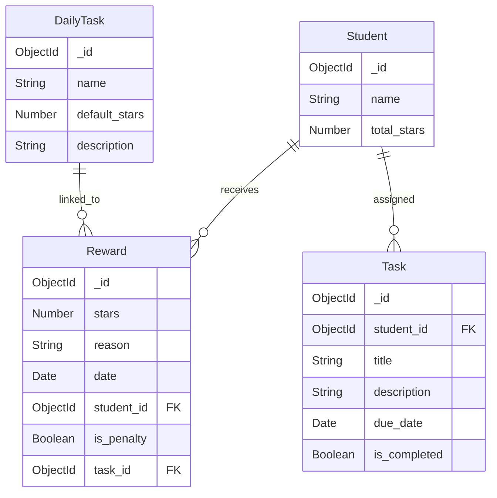

# Technical Design Document: Star Reward App (Node.js Version)

## 1. Tổng quan (Overview)
Star Reward App là một hệ thống quản lý điểm thưởng (sao) dành cho học sinh. Hệ thống cho phép phụ huynh/giáo viên tặng sao cho học sinh dựa trên các nhiệm vụ hoàn thành, theo dõi lịch sử và quản lý các công việc cần làm. Ứng dụng được xây dựng trên nền tảng Node.js với kiến trúc Monolith đơn giản, hiệu quả.

## 2. Kiến trúc hệ thống (System Architecture)

### 2.1. Tech Stack
- **Runtime**: Node.js
- **Web Framework**: Express.js
- **Database**: MongoDB (Mongoose ORM)
- **Template Engine**: Nunjucks
- **Frontend**: Bootstrap 5, Chart.js, Font Awesome 6

### 2.2. Cấu trúc thư mục (Directory Structure)
- `src/app.js`: Cấu hình server, middleware, kết nối database và định nghĩa các route chính.
- `src/models/`: Định nghĩa các Schema cho MongoDB.
- `src/routes/`: Tách biệt logic xử lý cho từng phân mục (Main, Learning, Exam).
- `src/utils/`: Các hàm tiện ích (ví dụ: seed dữ liệu).
- `app/templates/`: Chứa các file giao diện HTML sử dụng Nunjucks.
- `app/static/`: Chứa CSS, JS và hình ảnh tĩnh.

## 3. Thiết kế dữ liệu (Data Design)

### 3.1. Sơ đồ thực thể (ER Diagram - MongoDB)
Mặc dù MongoDB là NoSQL, chúng ta vẫn duy trì các mối quan hệ logic giữa các Collection:

### 3.2. Chi tiết Schema (Mongoose Models)

1. **Student**: Lưu thông tin học sinh và tổng điểm.
2. **DailyTask**: Danh mục các nhiệm vụ mặc định (ví dụ: Rửa bát, Học bài).
3. **Reward**: Nhật ký tặng/trừ sao. Lưu vết từng lần thay đổi điểm.
4. **Task**: Các nhiệm vụ cụ thể gán cho từng học sinh với thời hạn.

## 4. Thiết kế API & Routing

### 4.1. Main Routes (`/`)
- `GET /`: Trang chủ, danh sách học sinh.
- `POST /add_student`: Thêm học sinh mới.
- `GET /student/:id`: Chi tiết học sinh, danh sách nhiệm vụ và lịch sử sao.
- `POST /add_stars/:id`: Tặng hoặc trừ sao cho học sinh.
- `GET /get_star_history/:id`: API lấy dữ liệu lịch sử sao (phục vụ biểu đồ Chart.js).
- `GET /add_task/:student_id`: Trang thêm nhiệm vụ mới.
- `POST /add_task/:student_id`: Xử lý thêm nhiệm vụ.

### 4.2. Learning & Exam Routes
- `GET /learning`: Khu vực góc học tập.
- `GET /exam`: Khu vực góc thi cử.

## 5. Thiết kế giao diện (UI/UX Design)
- **Layout**: Sử dụng Sidebar cố định bên trái cho điều hướng chính.
- **Responsive**: Tương thích tốt trên Mobile và Tablet nhờ Bootstrap 5.
- **Visual**: 
  - Sử dụng màu sắc để phân biệt (Xanh cho tặng sao, Vàng/Đỏ cho trừ sao).
  - Biểu đồ đường (Line Chart) để theo dõi biến động điểm số theo thời gian.
  - Modal cho các hành động nhanh.

## 6. Bảo mật & Hiệu suất (Security & Performance)
- **Session**: Sử dụng `express-session` để quản lý phiên làm việc.
- **Flash Messages**: Sử dụng `connect-flash` để phản hồi tức thì cho người dùng.
- **Validation**: Kiểm tra dữ liệu đầu vào tại cả Client-side và Server-side (Mongoose validation).
- **Database**: Sử dụng Index trên các trường thường xuyên truy vấn như `student_id` và `date`.

## 7. Quy trình triển khai (Deployment)
- **Local**: Chạy bằng `nodemon` để tự động cập nhật khi thay đổi code.
- **Production**: Sử dụng `PM2` để quản lý quy trình và đảm bảo ứng dụng luôn chạy.
- **Database**: Kết nối tới MongoDB Local hoặc MongoDB Atlas.