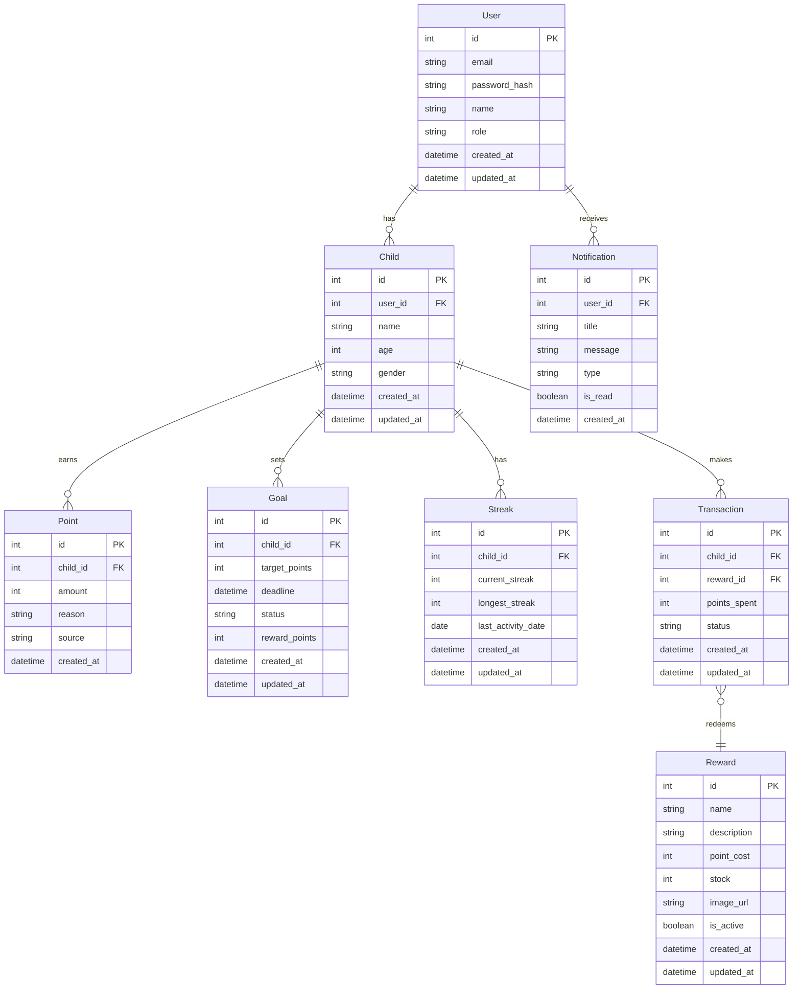

# Technical Design Document: Star Reward App

## 1. Overview
Star Reward App là một hệ thống quản lý phần thưởng và điểm thưởng, nhằm tăng tương tác và giữ chân khách hàng. Hệ thống cho phép người dùng tích điểm từ các hoạt động, đổi điểm lấy phần thưởng và theo dõi lịch sử giao dịch.

## 2. Requirements

### 2.1 Functional Requirements

#### Quản lý người dùng
* Người dùng có thể đăng ký tài khoản mới
* Người dùng có thể đăng nhập/đăng xuất
* Người dùng có thể xem và cập nhật thông tin cá nhân
* Người dùng có thể xem số điểm hiện tại và lịch sử điểm

#### Quản lý điểm thưởng
* Người dùng nhận điểm khi thực hiện các hoạt động được định nghĩa
* Admin có thể cấu hình các hoạt động và số điểm tương ứng
* Hệ thống tự động cập nhật điểm sau mỗi hoạt động
* Người dùng có thể xem lịch sử tích điểm chi tiết

#### Quản lý phần thưởng
* Admin có thể tạo và quản lý danh sách phần thưởng
* Admin có thể cấu hình điều kiện đổi thưởng
* Người dùng có thể xem danh sách phần thưởng khả dụng
* Người dùng có thể đổi điểm lấy phần thưởng
* Hệ thống tự động cập nhật số lượng phần thưởng còn lại

### 2.2 Non-Functional Requirements
* Hệ thống phải xử lý được 1000 giao dịch đồng thời
* Thời gian phản hồi API không quá 500ms
* Uptime tối thiểu 99.9%
* Dữ liệu người dùng phải được mã hóa
* Hệ thống phải có khả năng scale horizontally

## 3. Technical Design

### 3.1. Data Model



### 3.2. Database Design

#### Tables

1. **users**
```sql
CREATE TABLE users (
    id SERIAL PRIMARY KEY,
    email VARCHAR(255) UNIQUE NOT NULL,
    password_hash VARCHAR(255) NOT NULL,
    name VARCHAR(255) NOT NULL,
    role VARCHAR(50) DEFAULT 'user',
    created_at TIMESTAMP DEFAULT CURRENT_TIMESTAMP,
    updated_at TIMESTAMP DEFAULT CURRENT_TIMESTAMP
);
```

2. **children**
```sql
CREATE TABLE children (
    id SERIAL PRIMARY KEY,
    user_id INTEGER REFERENCES users(id) ON DELETE CASCADE,
    name VARCHAR(255) NOT NULL,
    age INTEGER NOT NULL,
    gender VARCHAR(10),
    created_at TIMESTAMP DEFAULT CURRENT_TIMESTAMP,
    updated_at TIMESTAMP DEFAULT CURRENT_TIMESTAMP
);
```

3. **points**
```sql
CREATE TABLE points (
    id SERIAL PRIMARY KEY,
    child_id INTEGER REFERENCES children(id) ON DELETE CASCADE,
    amount INTEGER NOT NULL,
    reason VARCHAR(255) NOT NULL,
    source VARCHAR(50) NOT NULL,
    created_at TIMESTAMP DEFAULT CURRENT_TIMESTAMP
);
```

4. **rewards**
```sql
CREATE TABLE rewards (
    id SERIAL PRIMARY KEY,
    name VARCHAR(255) NOT NULL,
    description TEXT,
    point_cost INTEGER NOT NULL,
    stock INTEGER NOT NULL DEFAULT 0,
    image_url VARCHAR(255),
    is_active BOOLEAN DEFAULT TRUE,
    created_at TIMESTAMP DEFAULT CURRENT_TIMESTAMP,
    updated_at TIMESTAMP DEFAULT CURRENT_TIMESTAMP
);
```

5. **transactions**
```sql
CREATE TABLE transactions (
    id SERIAL PRIMARY KEY,
    child_id INTEGER REFERENCES children(id) ON DELETE CASCADE,
    reward_id INTEGER REFERENCES rewards(id) ON DELETE CASCADE,
    points_spent INTEGER NOT NULL,
    status VARCHAR(50) NOT NULL,
    created_at TIMESTAMP DEFAULT CURRENT_TIMESTAMP,
    updated_at TIMESTAMP DEFAULT CURRENT_TIMESTAMP
);
```

6. **goals**
```sql
CREATE TABLE goals (
    id SERIAL PRIMARY KEY,
    child_id INTEGER REFERENCES children(id) ON DELETE CASCADE,
    target_points INTEGER NOT NULL,
    deadline TIMESTAMP,
    status VARCHAR(50) NOT NULL,
    reward_points INTEGER DEFAULT 0,
    created_at TIMESTAMP DEFAULT CURRENT_TIMESTAMP,
    updated_at TIMESTAMP DEFAULT CURRENT_TIMESTAMP
);
```

7. **streaks**
```sql
CREATE TABLE streaks (
    id SERIAL PRIMARY KEY,
    child_id INTEGER REFERENCES children(id) ON DELETE CASCADE,
    current_streak INTEGER DEFAULT 0,
    longest_streak INTEGER DEFAULT 0,
    last_activity_date DATE,
    created_at TIMESTAMP DEFAULT CURRENT_TIMESTAMP,
    updated_at TIMESTAMP DEFAULT CURRENT_TIMESTAMP
);
```

8. **notifications**
```sql
CREATE TABLE notifications (
    id SERIAL PRIMARY KEY,
    user_id INTEGER REFERENCES users(id) ON DELETE CASCADE,
    title VARCHAR(255) NOT NULL,
    message TEXT NOT NULL,
    type VARCHAR(50) NOT NULL,
    is_read BOOLEAN DEFAULT FALSE,
    created_at TIMESTAMP DEFAULT CURRENT_TIMESTAMP
);
```

#### Indexes

1. **users**
```sql
CREATE INDEX idx_users_email ON users(email);
CREATE INDEX idx_users_role ON users(role);
```

2. **children**
```sql
CREATE INDEX idx_children_user_id ON children(user_id);
CREATE INDEX idx_children_age ON children(age);
```

3. **points**
```sql
CREATE INDEX idx_points_child_id ON points(child_id);
CREATE INDEX idx_points_created_at ON points(created_at);
CREATE INDEX idx_points_source ON points(source);
```

4. **rewards**
```sql
CREATE INDEX idx_rewards_point_cost ON rewards(point_cost);
CREATE INDEX idx_rewards_is_active ON rewards(is_active);
```

5. **transactions**
```sql
CREATE INDEX idx_transactions_child_id ON transactions(child_id);
CREATE INDEX idx_transactions_reward_id ON transactions(reward_id);
CREATE INDEX idx_transactions_status ON transactions(status);
```

6. **goals**
```sql
CREATE INDEX idx_goals_child_id ON goals(child_id);
CREATE INDEX idx_goals_status ON goals(status);
CREATE INDEX idx_goals_deadline ON goals(deadline);
```

7. **streaks**
```sql
CREATE INDEX idx_streaks_child_id ON streaks(child_id);
CREATE INDEX idx_streaks_last_activity_date ON streaks(last_activity_date);
```

8. **notifications**
```sql
CREATE INDEX idx_notifications_user_id ON notifications(user_id);
CREATE INDEX idx_notifications_is_read ON notifications(is_read);
CREATE INDEX idx_notifications_created_at ON notifications(created_at);
```

### 3.3. API Design

#### User API
```json
POST /api/v1/users/register
{
    "email": "user@example.com",
    "password": "secure_password",
    "name": "User Name"
}

POST /api/v1/users/login
{
    "email": "user@example.com",
    "password": "secure_password"
}

GET /api/v1/users/me
Response:
{
    "id": 1,
    "email": "user@example.com",
    "name": "User Name",
    "role": "user"
}
```

#### Child API
```json
POST /api/v1/children
{
    "name": "Child Name",
    "age": 8,
    "gender": "male"
}

GET /api/v1/children/{id}
Response:
{
    "id": 1,
    "name": "Child Name",
    "age": 8,
    "gender": "male",
    "total_points": 1000
}
```

#### Point API
```json
POST /api/v1/points
{
    "child_id": 1,
    "amount": 10,
    "reason": "Hoàn thành bài tập",
    "source": "exercise"
}

GET /api/v1/children/{id}/points
Response:
{
    "total_points": 1000,
    "transactions": [
        {
            "id": 1,
            "amount": 10,
            "reason": "Hoàn thành bài tập",
            "source": "exercise",
            "created_at": "2024-03-20T10:00:00Z"
        }
    ]
}
```

#### Reward API
```json
GET /api/v1/rewards
Response:
{
    "rewards": [
        {
            "id": 1,
            "name": "Đồ chơi Lego",
            "description": "Bộ xếp hình Lego 1000 mảnh",
            "point_cost": 1000,
            "stock": 10,
            "image_url": "https://example.com/lego.jpg"
        }
    ]
}

POST /api/v1/rewards/redeem
{
    "child_id": 1,
    "reward_id": 1
}
```

#### Goal API
```json
POST /api/v1/goals
{
    "child_id": 1,
    "target_points": 1000,
    "deadline": "2024-12-31T23:59:59",
    "reward_points": 100
}

GET /api/v1/children/{id}/goals
Response:
{
    "goals": [
        {
            "id": 1,
            "target_points": 1000,
            "current_points": 500,
            "deadline": "2024-12-31T23:59:59",
            "status": "active",
            "reward_points": 100
        }
    ]
}
```

#### Streak API
```json
GET /api/v1/children/{id}/streak
Response:
{
    "current_streak": 5,
    "longest_streak": 10,
    "last_activity_date": "2024-03-20"
}
```

#### Notification API
```json
GET /api/v1/notifications
Response:
{
    "notifications": [
        {
            "id": 1,
            "title": "Chúc mừng!",
            "message": "Bạn đã nhận được 10 sao",
            "type": "points",
            "is_read": false,
            "created_at": "2024-03-20T10:00:00Z"
        }
    ]
}

PATCH /api/v1/notifications/{id}/read
{
    "is_read": true
}
```

### 3.4. Security Design

1. **Authentication**
   - JWT-based authentication
   - Refresh token rotation
   - Password hashing with bcrypt
   - Rate limiting for login attempts

2. **Authorization**
   - Role-based access control
   - Resource ownership validation
   - API key for external services

3. **Data Protection**
   - HTTPS for all communications
   - Data encryption at rest
   - Input validation and sanitization
   - SQL injection prevention

4. **Monitoring**
   - Logging of security events
   - Audit trail for sensitive operations
   - Regular security scans
   - Incident response plan

### 3.5. Performance Design

1. **Caching Strategy**
   - Redis for user sessions
   - Redis for frequently accessed data
   - CDN for static assets
   - Browser caching

2. **Database Optimization**
   - Proper indexing
   - Query optimization
   - Connection pooling
   - Read replicas for scaling

3. **API Optimization**
   - Response compression
   - Pagination
   - Field selection
   - Batch operations

4. **Monitoring**
   - Prometheus for metrics
   - Grafana for visualization
   - Alerting for anomalies
   - Performance logging

### 3.6. Deployment Design

1. **Infrastructure**
   - Docker containers
   - Kubernetes orchestration
   - Load balancing
   - Auto-scaling

2. **CI/CD Pipeline**
   - GitHub Actions
   - Automated testing
   - Staging environment
   - Blue-green deployment

3. **Monitoring**
   - Application metrics
   - Infrastructure metrics
   - Log aggregation
   - Alerting system

4. **Backup and Recovery**
   - Database backups
   - Point-in-time recovery
   - Disaster recovery plan
   - Regular testing

## 4. Testing Strategy

### 4.1. Unit Tests
- Test models and validations
- Test service logic
- Test utility functions
- Test API endpoints

### 4.2. Integration Tests
- Test database operations
- Test external service integrations
- Test authentication flows
- Test transaction handling

### 4.3. Performance Tests
- Load testing
- Stress testing
- Scalability testing
- Endurance testing

### 4.4. Security Tests
- Penetration testing
- Vulnerability scanning
- Security audit
- Compliance testing

## 5. Open Questions
1. Có nên implement point expiration không?
2. Làm thế nào để handle fraud detection?
3. Có nên có tier system cho users không?
4. Chiến lược backup và recovery?

## 6. Alternatives Considered
1. **NoSQL vs PostgreSQL**
   - Considered MongoDB for flexibility
   - Chose PostgreSQL for ACID compliance và transaction support

2. **Redis vs Memcached**
   - Considered Memcached for simplicity
   - Chose Redis for rich data structures và persistence

3. **Monolith vs Microservices**
   - Considered microservices for scalability
   - Chose monolith for initial development speed và simplicity 